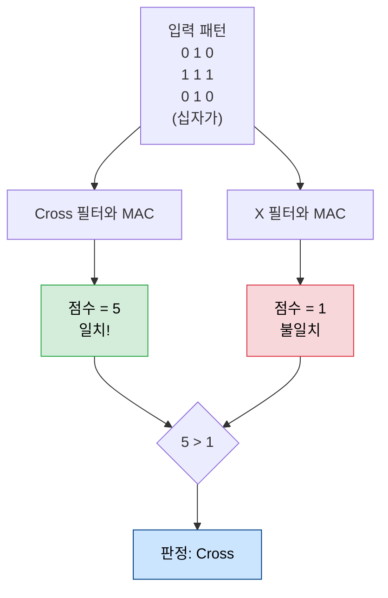
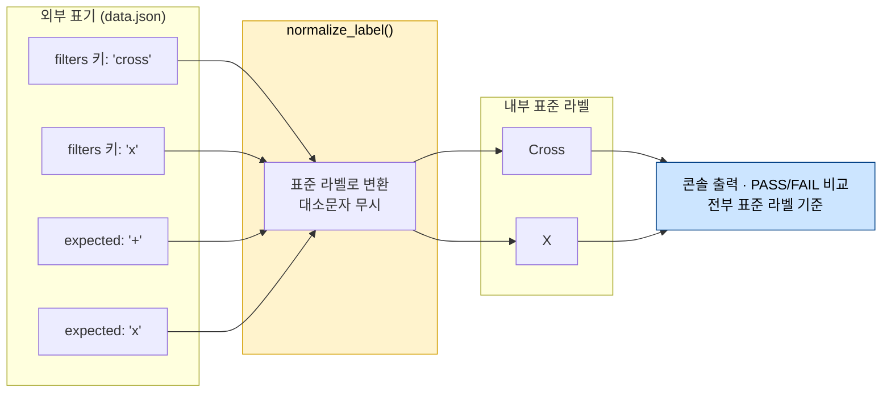
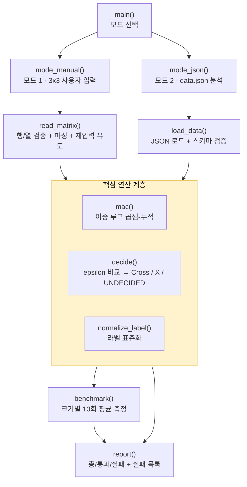
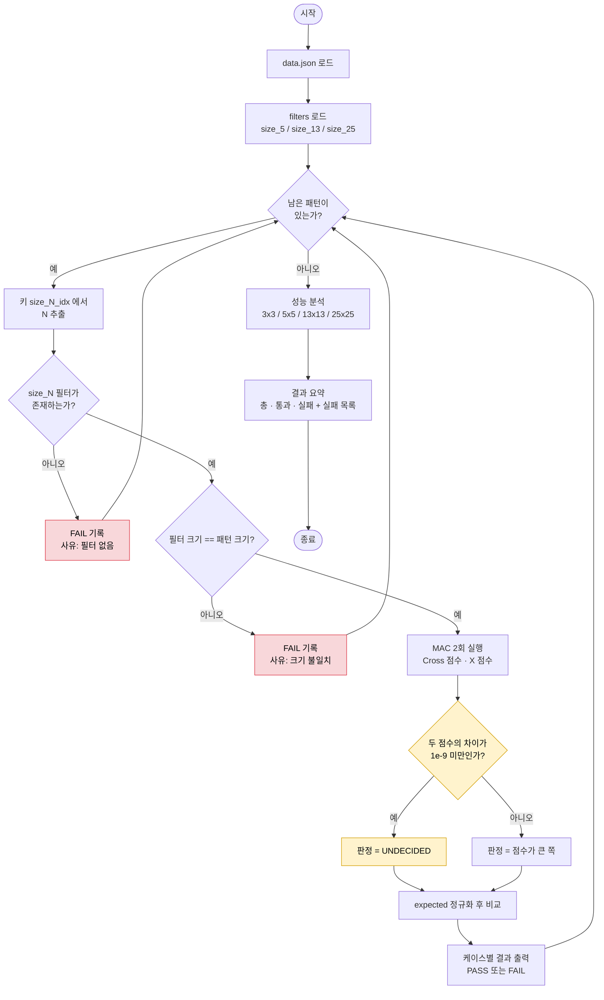
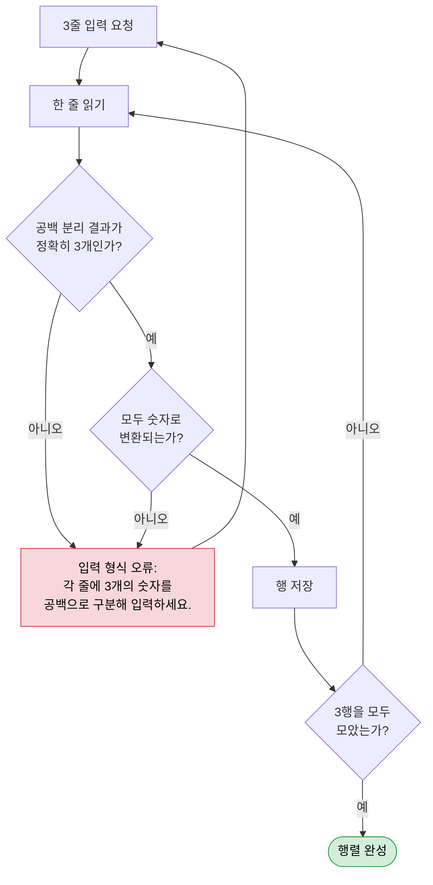
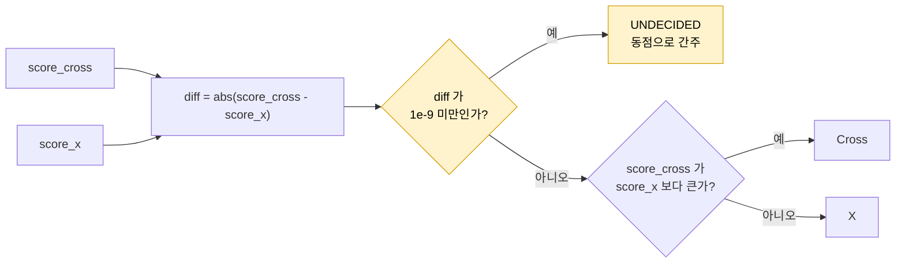

# 02. 개념 도식 — 그림으로 이해하는 Mini NPU

> 이 문서의 모든 도식은 Mermaid / ASCII로 작성되어 GitHub 및 GitHub Pages에서 그대로 렌더링된다.
> 발표 자료나 README에 그대로 복사해 쓸 수 있다.

---

## 1. 왜 이 미션이 존재하는가 — 문제의 사슬


---

## 2. 그림 → 숫자 배열

사람이 보는 것과 컴퓨터가 받는 것.

```text
      사람이 보는 것                컴퓨터가 받는 것
   ┌───────────────────┐        ┌───────────────────┐
   │  □  ■  □          │        │  0  1  0          │
   │  ■  ■  ■          │  ───►  │  1  1  1          │   Cross (십자가)
   │  □  ■  □          │        │  0  1  0          │
   └───────────────────┘        └───────────────────┘

   ┌───────────────────┐        ┌───────────────────┐
   │  ■  □  ■          │        │  1  0  1          │
   │  □  ■  □          │  ───►  │  0  1  0          │   X
   │  ■  □  ■          │        │  1  0  1          │
   └───────────────────┘        └───────────────────┘
```

---

## 3. MAC 연산 — Multiply and Accumulate

### 3-1. 한 장으로 보는 원리

```text
   입력 패턴          필터            위치별 곱          누적합
  ┌─────────┐     ┌─────────┐     ┌─────────────┐
  │ 0  1  0 │     │ 0  1  0 │     │ 0×0 1×1 0×0 │      0 + 1 + 0
  │ 1  1  1 │  ⊗  │ 1  1  1 │  =  │ 1×1 1×1 1×1 │  ►   1 + 1 + 1   ►  점수 5
  │ 0  1  0 │     │ 0  1  0 │     │ 0×0 1×1 0×0 │      0 + 1 + 0
  └─────────┘     └─────────┘     └─────────────┘
    Multiply  ────────────────────────►   Accumulate  ──────────►  Score
```

### 3-2. 같은 입력, 다른 필터 → 점수가 갈린다



### 3-3. 왜 곱셈이 "유사도"가 되는가

곱셈은 **AND 게이트**처럼 작동한다. 둘 다 켜져 있을 때만 점수가 쌓인다.

```text
   패턴 값 × 필터 값 = 기여도
   ─────────────────────────────────────
      1    ×    1    =  1   ← 둘 다 켜짐  → 점수 상승 ✅
      1    ×    0    =  0   ← 필터가 관심 없는 위치
      0    ×    1    =  0   ← 필터는 원했지만 패턴이 비어 있음
      0    ×    0    =  0   ← 둘 다 꺼짐
```

즉 **MAC 점수 = 두 배열의 내적(dot product)** 이고, 이는 "두 배열이 얼마나 같은 방향을 향하는가"를 재는 자다.

### 3-4. 코드로 옮기면

```python
def mac(pattern, filt, n):
    """외부 라이브러리 없이 이중 for 루프로 직접 구현."""
    total = 0.0
    for i in range(n):          # 행
        row_p = pattern[i]      # 행 참조를 지역 변수로 끌어오면 조금 빨라진다
        row_f = filt[i]
        for j in range(n):      # 열
            total += row_p[j] * row_f[j]   # Multiply → Accumulate
    return total
```

> 루프가 정확히 `N × N = N²`번 도는 것이 **O(N²)의 근거**다.

---

## 4. 라벨 정규화 — 왜 필요한가

`data.json`은 필터 키와 expected 값이 **서로 다른 표기법**을 쓴다. 비교 직전에 표준형으로 모으지 않으면 `'x' == 'X'`가 거짓이 되어 멀쩡한 판정도 FAIL이 된다.



| 입력 | 출처 | → 표준 라벨 |
| --- | --- | --- |
| `'cross'` | filters 키 | `Cross` |
| `'+'` | expected 값 | `Cross` |
| `'x'` | filters 키 | `X` |
| `'x'` | expected 값 | `X` |

---

## 5. 프로그램 구조와 실행 흐름

### 5-1. 모듈 구조 제안



### 5-2. 모드 2 전체 실행 흐름



**핵심**: 빨간 박스(에러 처리)가 모두 루프로 되돌아간다 = **프로그램은 절대 중단되지 않는다.**

### 5-3. 모드 1 입력 검증 루프



---

## 6. 성능과 시간 복잡도

### 6-1. 왜 O(N²)인가

필터 한 장과의 MAC은 **모든 칸을 정확히 한 번씩** 훑는다. 따라서 곱셈 횟수는 정확히 `N²`.

```text
  N=3  →  9 MAC        ▓
  N=5  →  25 MAC       ▓▓
  N=13 →  169 MAC      ▓▓▓▓▓▓▓▓
  N=25 →  625 MAC      ▓▓▓▓▓▓▓▓▓▓▓▓▓▓▓▓▓▓▓▓▓▓▓▓▓▓▓▓▓▓▓
                       └─ 막대 길이 ∝ N²

  N이 2배 → 연산량 4배   |   N이 5배 → 연산량 25배
```

### 6-2. 실측 참고값

순수 CPython 이중 루프 MAC의 실측치다. **절대값은 기기마다 다르므로 반드시 본인 환경에서 다시 측정할 것.**

<sub>측정 환경: Python 3.12.13 / macOS 15.7.4 x86_64 / 반복 측정 후 best-of-5 평균</sub>

| 크기 | 연산 횟수 N² | 평균 시간 (ms) | MAC 1회당 (µs) |
| --- | ---: | ---: | ---: |
| 3×3 | 9 | 0.0009 | 0.100 |
| 5×5 | 25 | 0.0017 | 0.069 |
| 13×13 | 169 | 0.0073 | 0.043 |
| 25×25 | 625 | 0.0236 | 0.038 |
| 50×50 | 2,500 | 0.0877 | 0.035 |
| 100×100 | 10,000 | 0.3342 | 0.033 |

**표를 읽는 법 (README 결과 리포트에 그대로 쓸 수 있는 해석)**

- N이 25 → 50으로 2배가 될 때 시간은 0.0236 → 0.0877ms로 **약 3.7배** 증가했다. 이론값 4배에 근접한다.
- 50 → 100에서도 0.0877 → 0.3342ms로 **약 3.8배**. `O(N²)`가 실측으로 확인된다.
- 다만 **작은 N에서는 비례가 무너진다.** 3×3의 MAC 1회당 비용(0.100µs)이 100×100(0.033µs)의 3배다.
  이는 함수 호출·루프 초기화 같은 **고정 오버헤드가 9번의 연산에 분산되지 못하기 때문**이다.
  → 그래서 미션이 **"10회 이상 반복 측정 후 평균"** 을 요구한다. 1회 측정은 오버헤드와 노이즈에 잠식된다.

### 6-3. 보너스 B1 — 1D 평탄화는 정말 빠른가?

동일 조건에서 2D 이중 루프 vs 1D 평탄화를 비교한 실측 결과다.

| 크기 | 2D 이중 루프 (ms) | 1D 인덱싱 (ms) | 1D + zip (ms) | 승자 |
| --- | ---: | ---: | ---: | --- |
| 3×3 | 0.0009 | **0.0005** | 0.0007 | 1D |
| 5×5 | 0.0017 | **0.0011** | 0.0013 | 1D |
| 13×13 | 0.0073 | **0.0058** | 0.0069 | 1D |
| 25×25 | **0.0236** | 0.0266 | 0.0245 | 2D |
| 50×50 | **0.0877** | 0.1182 | 0.1042 | 2D |
| 100×100 | **0.3342** | 0.4807 | 0.3925 | 2D |

> **결론 (정직하게 서술할 것)**: 1D 평탄화는 **작은 N에서만** 유리하고, N이 커지면 오히려 느려졌다.
> C/하드웨어에서는 1D 평탄화가 캐시 지역성 덕에 이득이지만, CPython에서는 리스트 인덱싱이 이미 O(1) 포인터 접근이고
> 병목이 **바이트코드 인터프리터 오버헤드**이기 때문이다. 2D 버전에서 `row = matrix[i]`로 행 참조를 지역 변수에 끌어오면
> 내부 루프의 인덱싱 비용이 이미 최소화된다.
> 보너스 과제를 제출할 때는 "빨라졌다"가 아니라 **"어느 구간에서 빨라졌고 왜 그런지"** 를 쓰는 것이 훨씬 높은 평가를 받는다.

---

## 7. 부동소수점과 epsilon — 이 미션의 진짜 관문

### 7-1. 무슨 일이 벌어지는가

```text
  0.1 은 이진 부동소수점으로 정확히 표현되지 않는다
        0.1  →  0.1000000000000000055511151231257827...

  9개를 더하면 더한 순서에 따라 최하위 비트가 흔들린다

     0.1 × 9  누적 방식 A  →  0.9000000000000000
     0.1 × 9  누적 방식 B  →  0.8999999999999999
                                            ↑ 여기가 다르다 (차이 1.1e-16)

  수학적으로는 완전히 같은 값인데, == 비교는 False를 반환한다.
```

### 7-2. epsilon 비교 정책



```python
EPSILON = 1e-9

def decide(score_cross, score_x):
    if abs(score_cross - score_x) < EPSILON:
        return "UNDECIDED"
    return "Cross" if score_cross > score_x else "X"
```

### 7-3. epsilon을 쓰지 않으면 무슨 일이 생기나

```text
  epsilon 없이 단순 비교 (score_cross > score_x)

     size_5_1  →  0.9 > 0.8999999999999999  →  Cross 로 판정
                  하지만 이 우열은 실제 유사도가 아니라
                  단지 "누적 순서가 만든 노이즈"다.

  ⚠️ 입력 순서, Python 버전, 컴파일러 최적화가 바뀌면
     판정이 뒤집힐 수 있다 = 재현 불가능한 프로그램.

  epsilon 정책은 "정답을 맞히기 위한" 장치가 아니라
  "노이즈로 판정하지 않겠다"는 선언이다.
```

> ⚠️ 실제 `data.json`에는 이 상황이 **3건이나 심어져 있다.** 자세한 분석은 [03-data.json-분석.md](03-data.json-분석.md).
