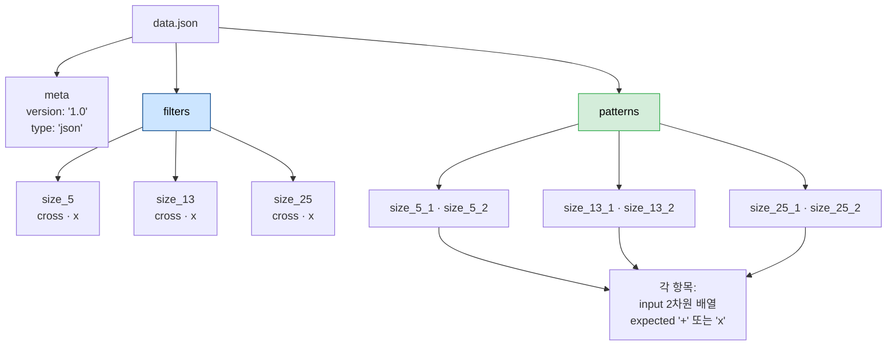
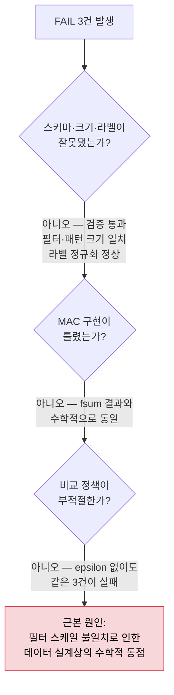

# 03. `data.json` 사전 분석 — 숨은 함정과 결과 리포트 근거

> 저장소 루트의 실제 [`data.json`](../data.json)을 **직접 계산해 본** 결과다.
> 여기 적힌 점수·판정은 추측이 아니라 실행 결과이며, 구현이 끝난 뒤 자기 프로그램의 출력과 대조하는 **정답지**로 쓸 수 있다.

---

## 1. 파일 구조



| 사실 | 값 |
| --- | --- |
| 필터 크기 | `size_5`, `size_13`, `size_25` — **총 3종** |
| 필터 라벨 키 | `cross`, `x` (**소문자**) → 정규화 필요 |
| 패턴 개수 | **6개** (크기당 2개) |
| `expected` 표기 | `'+'`, `'x'` → 정규화 필요 |
| 모든 값의 타입 | **전부 `float`** (`1.0`, `0.1`, `0.3`, `0.9` …) — 정수 없음 |
| **`size_3` 필터** | **존재하지 않음** ⚠️ |

> ⚠️ **주의 1**: 미션 명세는 성능 분석표에 3×3을 포함하라고 요구하지만 `data.json`에는 `size_3`이 없다.
> → 3×3 필터/패턴은 **프로그램에서 자체 생성**해야 한다.
>
> ⚠️ **주의 2**: 원본 명세의 출력 예시는 "총 테스트 8개"라고 되어 있지만 **실제 파일의 패턴은 6개**다.
> 예시는 참고용이므로 실제 개수(6)를 출력하는 것이 맞다.

---

## 2. 필터 설계 — 여기에 함정이 있다

각 크기별 두 필터의 값 분포를 뽑아 보면 **의도적인 비대칭**이 드러난다.

| 크기 | 필터 | 0이 아닌 칸 수 | 값 구성 | **전체 합** |
| --- | --- | ---: | --- | ---: |
| 5×5 | `cross` | 9 | `1.0` × 8, **중앙 `0.9`** | 8.9 |
| 5×5 | `x` | 9 | `0.1` × 9 | **0.9** |
| 13×13 | `cross` | 25 | `0.3` × 25 | **7.5** |
| 13×13 | `x` | 25 | `0.3` × 24, **중앙 `7.5`** | 14.7 |
| 25×25 | `cross` | 49 | `1.0` × 48, **중앙 `4.9`** | 52.9 |
| 25×25 | `x` | 49 | `0.1` × 49 | **4.9** |

### 눈치챘는가?

굵게 표시한 숫자를 나란히 놓아 보자.

```text
  5×5   : cross 필터의 중앙값 0.9  ==  x 필터의 전체 합 0.9
  13×13 : x 필터의 중앙값 7.5      ==  cross 필터의 전체 합 7.5
  25×25 : cross 필터의 중앙값 4.9  ==  x 필터의 전체 합 4.9
```

**한 필터의 중앙 가중치가, 상대 필터의 총합과 정확히 같도록 맞춰져 있다.**

Cross 패턴과 X 패턴은 **오직 중앙 한 칸에서만 겹친다**는 성질을 이용한 설계다.

```text
     Cross 패턴 ∩ X 필터  =  중앙 1칸뿐
     X 패턴     ∩ Cross 필터 =  중앙 1칸뿐

                □ ■ □          ■ □ ■
                ■ ■ ■   ∩      □ ■ □     =    가운데 한 칸
                □ ■ □          ■ □ ■
```

그래서 이런 일이 벌어진다 (5×5, 입력이 완전한 X 패턴일 때):

```text
   X 패턴 vs Cross 필터  →  중앙에서만 겹침       →  1.0 × 0.9        = 0.9
   X 패턴 vs X 필터      →  9칸 전부 겹침         →  1.0 × 0.1 × 9    = 0.9
                                                     ─────────────────────
                                                     수학적으로 완전히 동점
```

> 🎯 **이 미션의 진짜 문제는 부동소수점 오차 자체가 아니라, "스케일이 다른 필터끼리 원시 MAC 점수를 직접 비교하는 것"이다.**
> 부동소수점은 그 동점을 **눈에 보이게 드러낸 증상**일 뿐이다.

---

## 3. 전체 케이스 계산 결과 (정답지)

`epsilon = 1e-9` 정책 적용, 순수 Python 이중 루프 MAC 기준.

| 케이스 | N | Cross 점수 | X 점수 | 차이 | 판정 | expected | 결과 |
| --- | ---: | --- | --- | --- | --- | --- | --- |
| `size_5_1` | 5 | `0.9` | `0.8999999999999999` | `1.11e-16` | **UNDECIDED** | X | ❌ FAIL |
| `size_5_2` | 5 | `8.9` | `0.1` | `8.8` | Cross | Cross | ✅ PASS |
| `size_13_1` | 13 | `0.3` | `14.700000000000008` | `-14.4` | X | X | ✅ PASS |
| `size_13_2` | 13 | `7.499999999999997` | `7.5` | `-2.66e-15` | **UNDECIDED** | Cross | ❌ FAIL |
| `size_25_1` | 25 | `4.9` | `4.899999999999999` | `1.78e-15` | **UNDECIDED** | X | ❌ FAIL |
| `size_25_2` | 25 | `52.9` | `0.1` | `52.8` | Cross | Cross | ✅ PASS |

```text
   총 테스트: 6개
   통과:     3개
   실패:     3개

   실패 케이스:
     - size_5_1 : 동점(UNDECIDED) 처리 규칙에 따라 FAIL  (|차이| = 1.1e-16 < 1e-9)
     - size_13_2: 동점(UNDECIDED) 처리 규칙에 따라 FAIL  (|차이| = 2.7e-15 < 1e-9)
     - size_25_1: 동점(UNDECIDED) 처리 규칙에 따라 FAIL  (|차이| = 1.8e-15 < 1e-9)
```

### 규칙성

```text
  각 크기마다 정확히 1개씩 실패한다.
  실패하는 쪽은 언제나 "스케일이 작게 눌린 필터가 정답인" 케이스다.

    5×5   : x 필터가 0.1배로 눌림      → x 가 정답인 size_5_1 이 실패
    13×13 : cross 필터가 0.3배로 눌림  → cross 가 정답인 size_13_2 가 실패
    25×25 : x 필터가 0.1배로 눌림      → x 가 정답인 size_25_1 이 실패
```

---

## 4. 검증 — 정말 "부동소수점 오차"가 맞는가?

추측을 배제하기 위해 세 가지로 교차 확인했다.

### 검증 ① 정확 합산(`math.fsum`)으로 계산하면 오차가 사라진다

`math.fsum`은 반올림 오차 없이 합산한다. 이걸로 다시 계산하면:

| 케이스 | 일반 합산 | `math.fsum` |
| --- | --- | --- |
| `size_5_1` | 0.9 vs 0.8999999999999999 | **0.9 vs 0.9 → 완전 일치** |
| `size_13_2` | 7.499999999999997 vs 7.5 | **7.5 vs 7.5 → 완전 일치** |
| `size_25_1` | 4.9 vs 4.899999999999999 | **4.9 vs 4.9 → 완전 일치** |

> ✅ **결론**: 세 케이스의 두 점수는 **수학적으로 정확히 같다.**
> 일반 합산에서 보이는 미세한 차이는 100% 누적 반올림 오차이며, 실제 유사도 차이가 아니다.
> → **epsilon으로 동점 처리하는 것이 수학적으로 옳은 동작이다.**

### 검증 ② 합산 순서를 바꿔도 결과가 안정적인가

행 우선 / 열 우선 / 값 크기순으로 누적 순서를 바꿔 계산해 봤다. 이 데이터에서는 세 방식 모두 같은 부호가 나왔다
(0이 아닌 항의 개수가 적고 값이 균일해서 오차 패턴이 동일하게 재현된다).
**하지만** 이는 이 데이터가 운 좋게 안정적이었을 뿐, 값 구성이 조금만 달라져도 뒤집힐 수 있는 크기(1e-16)의 차이다.
**1e-16 규모의 우열에 판정을 맡기는 것 자체가 설계 결함**이라는 결론은 그대로다.

### 검증 ③ epsilon을 안 쓰면 결과가 나아지는가 → **아니다**

`epsilon` 없이 단순히 `score_cross > score_x`로 판정하면:

| 케이스 | 단순 비교 판정 | expected | 결과 |
| --- | --- | --- | --- |
| `size_5_1` | Cross | X | ❌ FAIL |
| `size_13_2` | X | Cross | ❌ FAIL |
| `size_25_1` | Cross | X | ❌ FAIL |

> **실패 개수는 3개로 똑같다.** 차이는 결과가 아니라 **진단 가능성**에 있다.
>
> - epsilon **없이**: "왜 틀렸는지 알 수 없는 오답" 3개. 노이즈가 만든 우열을 진짜 판정으로 착각한다.
> - epsilon **적용**: "동점이라 판정할 수 없음"이라고 **명시적으로 신고**하는 3개.
>
> epsilon 정책은 정답률을 올리는 장치가 아니라, **틀린 이유를 드러내는 장치**다. 이것이 미션이 epsilon을 요구한 진짜 이유다.

---

## 5. 실패 원인 3분류 — 어디에 속하는가

미션 학습 목표는 실패를 **"데이터/스키마 문제 vs 로직 문제 vs 수치 비교 문제"** 로 분리해 진단하라고 요구한다.



| 분류 | 해당 여부 | 근거 |
| --- | :---: | --- |
| ① 데이터/스키마 문제 | **✅ 해당 (근본 원인)** | 두 필터의 스케일(총합)이 9.9배~12배 차이나도록 설계됨 → 원시 MAC 점수가 비교 불가능한 척도가 됨 |
| ② 로직 문제 | ❌ 아님 | MAC 구현은 정확. `math.fsum` 정확 합산 결과와 수학적으로 일치 |
| ③ 수치 비교 문제 | △ 증상만 | 부동소수점 오차는 ①이 만든 동점을 **드러낸 증상**. epsilon을 빼도 실패는 그대로 3건 |

**한 문장 결론**:
> 이 3건의 FAIL은 프로그램 버그가 아니라, **서로 다른 스케일의 필터를 정규화 없이 원시 MAC 점수로 직접 비교했을 때 생기는 구조적 한계**이며, epsilon 정책은 그 한계를 조용히 넘어가지 않고 `UNDECIDED`로 정직하게 신고한 결과다.

---

## 6. 해결 방향 — 필터 정규화 (보너스/심화 서술용)

원시 점수 대신 **필터 크기로 나눈 정규화 점수(코사인 유사도)** 를 쓰면 스케일 차이가 상쇄된다.

```python
# 원시 MAC:        score = Σ (pattern · filter)
# 정규화 MAC:      score = Σ (pattern · filter) / (‖filter‖₂ × ‖pattern‖₂)
#                  ‖v‖₂ = sqrt(Σ v²)
```

이 방식으로 6개 케이스를 다시 계산한 결과:

| 케이스 | 원시 Cross | 원시 X | → 정규화 Cross | 정규화 X | 판정 | expected | 결과 |
| --- | ---: | ---: | ---: | ---: | --- | --- | --- |
| `size_5_1` | 0.9000 | 0.9000 | 0.1011 | **1.0000** | X | X | ✅ PASS |
| `size_5_2` | 8.9000 | 0.1000 | **0.9995** | 0.1111 | Cross | Cross | ✅ PASS |
| `size_13_1` | 0.3000 | 14.7000 | 0.0400 | **0.3847** | X | X | ✅ PASS |
| `size_13_2` | 7.5000 | 7.5000 | **1.0000** | 0.1963 | Cross | Cross | ✅ PASS |
| `size_25_1` | 4.9000 | 4.9000 | 0.0825 | **1.0000** | X | X | ✅ PASS |
| `size_25_2` | 52.9000 | 0.1000 | **0.8906** | 0.0204 | Cross | Cross | ✅ PASS |

```text
   정규화 적용 시:  총 6개 / 통과 6개 / 실패 0개
```

동점이 **완전히 사라진다.** 애매하던 세 케이스가 `0.1011 vs 1.0000`처럼 압도적 차이로 갈린다.
필터의 L2 노름 비율이 5×5에서 9.89배, 25×25에서 12.12배였던 것을 상쇄했기 때문이다.

> ⚠️ **제출 시 주의**: 미션의 기본 요구사항은 **원시 MAC 점수 + epsilon 비교**다.
> 정규화를 기본 판정 로직으로 바꿔 버리면 요구사항 위반이다.
> **기본 동작은 원시 MAC(3 FAIL)으로 두고**, 정규화는 README의 결과 리포트나 보너스 항목에서
> "이렇게 하면 해결된다"는 **분석·개선안**으로 제시하는 것이 정답이다.
> (원한다면 `--normalize` 같은 선택 플래그로 부가 기능화하는 것도 좋다.)

---

## 7. README "결과 리포트" 작성용 뼈대

아래 항목을 채우면 미션이 요구하는 **10줄 이상** 요건을 자연스럽게 넘긴다.

```text
[결과 리포트]

1. 총계: 총 6개 / 통과 3개 / 실패 3개

2. 실패 케이스와 사유
   - size_5_1  : Cross 0.9 vs X 0.8999999999999999, 차이 1.1e-16 → UNDECIDED
   - size_13_2 : Cross 7.499999999999997 vs X 7.5, 차이 2.7e-15 → UNDECIDED
   - size_25_1 : Cross 4.9 vs X 4.899999999999999, 차이 1.8e-15 → UNDECIDED

3. 원인 분류
   - 데이터/스키마 문제인가? → 예. 근본 원인. 두 필터의 총합 스케일이 9.9~12배 차이남
   - 로직 문제인가?         → 아니오. math.fsum 정확 합산 결과와 수학적으로 일치
   - 수치 비교 문제인가?     → 증상만. epsilon을 제거해도 동일하게 3건 실패

4. 왜 이런 동점이 생겼는가
   - Cross 패턴과 X 패턴은 중앙 한 칸에서만 겹친다
   - 데이터는 한 필터의 중앙 가중치를 상대 필터의 총합과 같게 맞춰 놓았다
   - 따라서 "정답 필터의 전체 점수"와 "오답 필터의 중앙 한 칸 점수"가 수학적으로 동일해진다

5. epsilon 정책의 역할
   - 정답률을 올리지 않는다. 1e-16 규모의 노이즈로 판정하는 것을 막는다
   - epsilon 없이 판정하면 재현성 없는 오답이 되고, epsilon을 쓰면 UNDECIDED로 명시 신고된다

6. 개선안
   - 필터를 L2 노름으로 정규화(코사인 유사도)하면 6/6 통과 (검증 완료)
   - 단, 기본 요구사항은 원시 MAC + epsilon이므로 개선안은 선택 기능으로 분리

7. 시간 복잡도
   - MAC 1회의 곱셈 횟수는 정확히 N² → O(N²)
   - 실측: 25×25 → 50×50 에서 약 3.7배, 50×50 → 100×100 에서 약 3.8배 (이론 4배에 근접)
   - 작은 N에서는 함수 호출·루프 초기화 오버헤드가 지배적이라 비례가 무너진다
     → 미션이 "10회 이상 반복 평균"을 요구하는 이유
```
